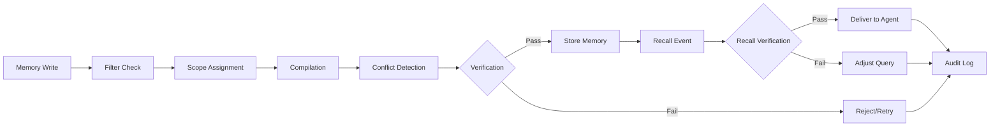

# Architecture Overview

OpenViking is structured as a memory compilation and orchestration layer that sits between your agents and raw storage systems.

## High-Level Architecture

```mermaid
graph TB
    subgraph "Agent Layer"
        Agent1[Your Agent]
        Agent2[Another Agent]
        Agent3[Third-Party Agent]
    end

    subgraph "OpenViking Layer"
        subgraph "Memory Compilation Pipeline"
            Filter[Content Filtering]
            Scope[Scope Determination]
            Compile[Memory Compilation]
            Conflict[Conflict Resolution]
        end

        subgraph "Orchestration & Governance"
            Recall[Smart Recall]
            Verify[Verification]
            Audit[Audit & Trace]
            Governance[Governance Policies]
        end
    end

    subgraph "Storage Layer"
        Vector[Vector DB]
        KV[Key-Value Store]
        SQL[Relational DB]
        File[File Storage]
    end

    Agent1 --> OpenViking Layer
    Agent2 --> OpenViking Layer
    Agent3 --> OpenViking Layer

    Filter --> Scope
    Scope --> Compile
    Compile --> Conflict

    Conflict --> Recall
    Recall --> Verify
    Verify --> Audit
    Audit --> Governance

    OpenViking Layer --> Storage Layer
```

## Core Pipeline Flow

The memory pipeline processes operations in this sequence:

1. **Write Path**
   - Content filtering (what to keep vs. discard)
   - Scope determination (tenant, agent, session)
   - Memory compilation (transforming raw data into structured form)
   - Conflict detection and resolution

2. **Read Path**
   - Query parsing and intent understanding
   - Smart recall (how much, which format, what context)
   - Result compilation and coherence checking
   - Response delivery

## Edition Layers

OpenViking uses a tiered architecture to match different deployment needs:

```mermaid
graph TB
    subgraph "Enterprise Edition"
        Offline[Offline Execution Windows]
        ExecuteEngine[Execute Engine]
        FullAudit[Complete Audit Chain]
        StrictGovernance[Strict Governance]
    end

    subgraph "Pro Edition"
        Installer[Standard Installer]
        Upgrade[Upgrade/Rollback]
        Acceptance[Acceptance Verification]
        BasicAudit[Basic Audit Reports]
    end

    subgraph "GitHub Edition"
        Core[Core Memory Logic]
        BasicAdapter[Basic Memory Adapter]
        Strategy[Strategy Configuration]
        Example[Supervisor Skill Example]
    end

    GitHub Edition --> Pro Edition
    Pro Edition --> Enterprise Edition

    %% Memory Pipeline Foundation
    subgraph "Memory Pipeline Foundation"
        Filtering[Filtering]
        Scoping[Scoping]
        Compilation[Compilation]
        RecallLogic[Recall Logic]
        ConflictResolution[Conflict Resolution]
    end

    Core --> Memory Pipeline Foundation
```

### GitHub Edition Layer

This layer provides:
- Core memory compilation and orchestration logic
- Basic memory adapter (write, search, read, delete)
- P1 strategy configuration externalization
- Basic tenant isolation
- Minimal working examples

### Pro Edition Layer

Adds on top of GitHub Edition:
- Standard installer and deployment
- Acceptance verification suite
- Upgrade/rollback mechanisms
- Basic audit reporting
- Standard support boundary

### Enterprise Edition Layer

Adds on top of Pro Edition:
- Offline execution windows
- Execute Engine with packet-based delivery
- Complete audit evidence chain
- Strict governance and recovery
- Enterprise-grade support

## Verification & Governance Relationship



## Key Design Principles

1. **Pipeline First**: Memory operations flow through a defined pipeline, not ad-hoc functions
2. **Configurable Strategies**: Behavior is controlled by externalized configuration, not hard-coded logic
3. **Verifiable Operations**: Every step can be audited and verified
4. **Tenant-Isolated**: Multi-tenant support is baked into the architecture
5. **Layered Editions**: Capabilities build on each other across editions

## Next Steps

- See [editions.md](./editions.md) for detailed capability boundaries
- See [pricing-and-upgrade.md](./pricing-and-upgrade.md) for upgrade paths
- Explore the [supervisor skill example](../supervisor/skills/video-prompt-engineering/SKILL.md) to see structured knowledge packaging in practice
